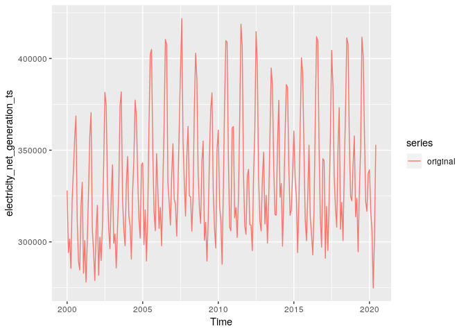
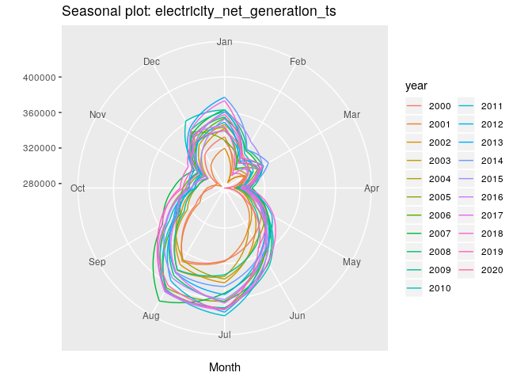
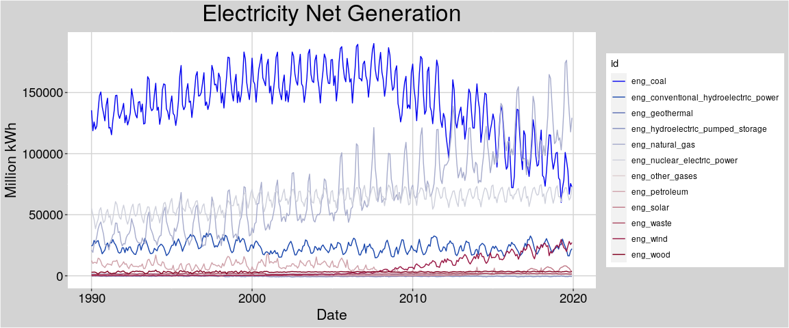
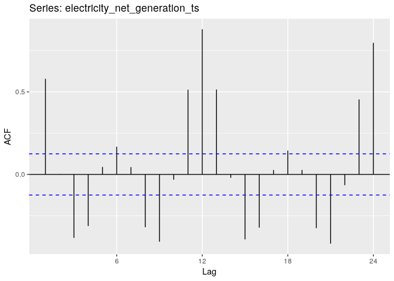

```r
library(sparklyr)
library(dplyr)
```

```
## 
## Attaching package: 'dplyr'
```

```
## The following objects are masked from 'package:stats':
## 
##     filter, lag
```

```
## The following objects are masked from 'package:base':
## 
##     intersect, setdiff, setequal, union
```

```r
library(tidyr)
library(forecast)
library(kableExtra)
```

```
## 
## Attaching package: 'kableExtra'
```

```
## The following object is masked from 'package:dplyr':
## 
##     group_rows
```

```r
library(ggplot2)
```


```r
sc <- sparklyr::spark_connect(
  master = 'local[2]', 
  spark_home = '/usr/local/spark3')
total_energy_df <- sparklyr::spark_read_parquet(
  sc = sc, 
  name = 'total_energy_test_df', 
  path = "hdfs://localhost:9000/Processed/TotalEnergyDF")
total_energy_df <- select(total_energy_df, "date", "name", "value", "units") %>% 
  mutate(
    date = as.date(date),
    value = as.numeric(value))
```


```r
electricity_net_generation_df <- 
  total_energy_df %>% 
  filter(name %rlike% "Electricity Net Generation Total.* All Sectors$")
```


```r
electricity_net_generation_df %>% 
  filter(is.na(name) | name == '') %>% 
  dplyr::count(name = "null fields") %>% 
  kable('html') %>% 
  kable_styling(
    bootstrap_options = 'striped',
    font_size = 20)
```

<table class="table table-striped" style="font-size: 20px; margin-left: auto; margin-right: auto;">
 <thead>
  <tr>
   <th style="text-align:right;"> null fields </th>
  </tr>
 </thead>
<tbody>
  <tr>
   <td style="text-align:right;"> 0 </td>
  </tr>
</tbody>
</table>

```r
date_limit_df <- electricity_net_generation_df %>% 
  group_by() %>% 
  summarize(
    min_date = min(date), 
    max_date = max(date)) %>% 
  collect()
```

```
## Warning: Missing values are always removed in SQL.
## Use `MIN(x, na.rm = TRUE)` to silence this warning
## This warning is displayed only once per session.
```

```
## Warning: Missing values are always removed in SQL.
## Use `MAX(x, na.rm = TRUE)` to silence this warning
## This warning is displayed only once per session.
```


```r
electricity_net_generation_ts <- ts(
  data = electricity_net_generation_df %>%  
    arrange(date) %>% 
    select("value") %>% 
    collect() %>% 
    pull("value"), 
  start = c(
    as.numeric(format(date_limit_df["min_date"][[1]], "%Y")), 
    as.numeric(format(date_limit_df["min_date"][[1]], "%m"))),
  end = c(
    as.numeric(format(date_limit_df["max_date"][[1]], "%Y")), 
    as.numeric(format(date_limit_df["max_date"][[1]], "%m"))),
  frequency = 12)
electricity_net_generation_ts <- window(electricity_net_generation_ts, start=c(2000,1))
```


```r
autoplot(electricity_net_generation_ts, series='original')
```

<!-- -->

```r
ggseasonplot(electricity_net_generation_ts, polar=TRUE)
```

<!-- -->


```r
electricity_net_generation_ts %>%  stl(s.window = 24) %>% autoplot()
```

<!-- -->

```r
ggAcf(electricity_net_generation_ts)
```

<!-- -->

```r
# run checkresiduals(fit) for outputs
```

```r
#could do multivariate test with cooling demand, which is also in this data set
```

